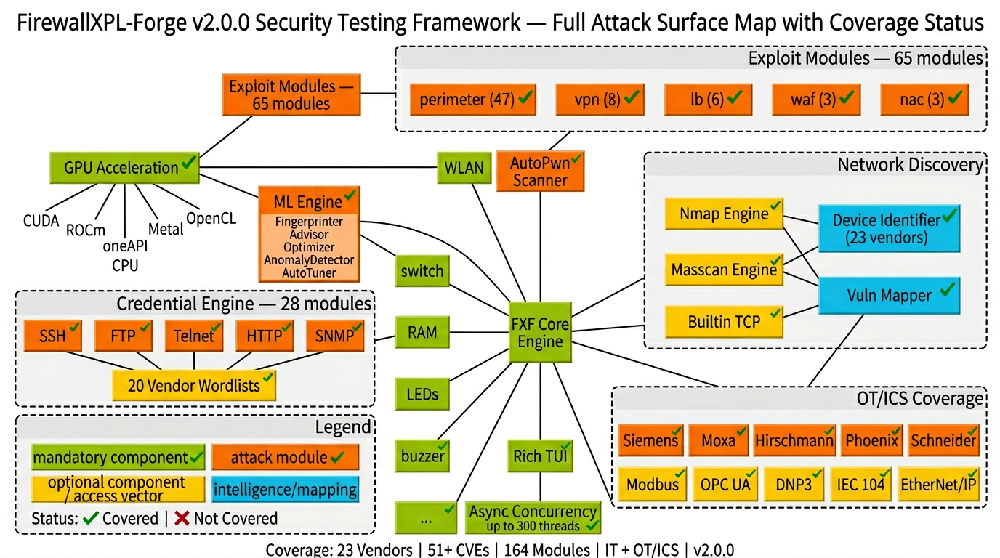

# FirewallXPL-Forge

> **⚠ MIGRATION NOTICE — v2.1.0 (Final Release)**
>
> FirewallXPL-Forge has been **merged into [EmbedXPL-Forge](https://github.com/mrhenrike/EmbedXPL-Forge)**.
> All 81 unique modules (Fortinet, Cisco, Palo Alto, SonicWall, Sophos, Juniper, F5 BIG-IP,
> Citrix, Barracuda, A10, Imperva, NAC, pfSense, OT perimeter) are now available under
> `embedxpl/modules/exploits/firewalls/` and related paths.
>
> **To migrate:**
> ```bash
> pip install embedxpl       # replaces firewallxpl
> exf                        # new CLI (fxf alias also available)
> ```
> FirewallXPL-Forge **v2.1.0** is the final standalone release. This repository will remain
> archived for reference but **will not receive new modules or CVE coverage**.

---

**Perimeter security exploitation framework** — 164 modules covering **FW, NGFW, UTM, WAF, VPN, NAC, LB**, and **OT/ICS** industrial firewalls across **23 vendors** and **51+ CVEs**.

**Author:** André Henrique ([@mrhenrike](https://github.com/mrhenrike)) \| [União Geek](https://github.com/Uniao-Geek)

**Language:** **English (en-US)** — default. **Português (pt-BR):** [README.pt-BR.md](README.pt-BR.md)

[](https://www.python.org/downloads/)
[](https://github.com/mrhenrike/FirewallXPL-Forge/actions)
[](https://pypi.org/project/firewallxpl/)

---

## Architecture & Attack Surface Map



---

## Install

```bash
# From PyPI (recommended)
pip install firewallxpl

# With Rich TUI + Nmap discovery
pip install firewallxpl[tui,discovery]

# With ML engine + GPU acceleration
pip install firewallxpl[ml,gpu-nvidia]

# Everything
pip install firewallxpl[full]

# From source
git clone https://github.com/mrhenrike/FirewallXPL-Forge.git
cd FirewallXPL-Forge
pip install -e ".[tui,discovery]"
python fxf.py
```

### Environment diagnostics

```bash
python tools/env_doctor.py
```

---

## What the project does

FirewallXPL-Forge provides **modules** for **authorized** security testing against perimeter devices (pentest, lab, controlled red team). Target classes: `perimeter`, `waf`, `vpn`, `nac`, `lb`.

| Type | Role |
|------|------|
| **exploits** | Abuse known vulnerabilities — `check()` + `run()` per module |
| **creds** | Default credentials and brute force against SSH, FTP, Telnet, HTTP, SNMP |
| **scanners** | Weakness identification; **AutoPwn** orchestrates all modules with Nmap-style timing (T0–T5) |
| **payloads** | Payload generation by architecture (ARM/MIPS/x86/x64, reverse/bind shells) |
| **encoders** | Payload encoding (Python, PHP, Perl) |
| **generic** | Cross-cutting utilities: CVE lookup, SNMP, SSDP, wordlist generator |

**Out of scope:** IP cameras, printers, DVRs, consumer routers.

---

## Vendor coverage (23 vendors, 51+ CVEs)

### IT Security Appliances

| Vendor | Modules | Key CVEs |
|--------|---------|----------|
| Fortinet FortiOS/FortiGate | 9 | CVE-2018-13379, CVE-2022-40684, CVE-2024-21762, CVE-2024-47575 |
| Cisco ASA/FTD/IOS XE | 4 | CVE-2020-3452, CVE-2023-20198, CVE-2023-20269 |
| Palo Alto PAN-OS | 5 | CVE-2024-0012, CVE-2024-3400, CVE-2025-0108 |
| F5 BIG-IP | 6 | CVE-2020-5902, CVE-2022-1388, CVE-2023-46747 |
| Citrix/NetScaler | 3 | CVE-2019-19781, CVE-2023-3519, CVE-2023-4966 |
| SonicWall | 6 | CVE-2020-5135, CVE-2024-40766, CVE-2024-53704 |
| Ivanti/Pulse Secure | 3 | CVE-2019-11510, CVE-2023-46805+21887, CVE-2025-0282 |
| Juniper SRX/EX | 2 | CVE-2023-36845, CVE-2024-21591 |
| Sophos XG | 3 | CVE-2020-12271, CVE-2022-1040, CVE-2022-3236 |
| Check Point | 1 | CVE-2024-24919 |
| WatchGuard | 2 | XCS RCE, CVE-2022-23176 |
| Zyxel USG | 3 | CVE-2022-30525, CVE-2023-28771, CVE-2023-33009 |
| pfSense | 3 | CVE-2022-31814, CVE-2023-27100, CVE-2023-42326 |
| Barracuda | 3 | CVE-2023-2868, CVE-2023-7102, SecureSphere SQLi |

### OT/ICS Industrial Firewalls

| Vendor | Modules | Key CVEs |
|--------|---------|----------|
| Siemens SCALANCE/SINEMA/RUGGEDCOM | 3 | CVE-2022-32257, CVE-2023-24845, CVE-2023-44373 |
| Moxa EDR | 2 | CVE-2024-9137 (CVSS 9.9), CVE-2024-9138 |
| Hirschmann EAGLE | 1 | CVE-2020-6994 |
| Phoenix Contact mGuard | 1 | CVE-2024-43386 |
| Schneider ConneXium/Tofino | 1 | CVE-2017-6026 |
| Cisco ISA-3000 | 1 | CVE-2018-0101 (CVSS 10.0) |
| Secomea GateManager | 1 | CVE-2020-14500 (CVSS 10.0) |
| Ewon/HMS Cosy+ | 1 | CVE-2026-25823 |

### OT Protocol Bypass

Modbus TCP, OPC UA, DNP3, IEC 60870-5-104, EtherNet/IP CIP

### Generic Techniques

HTTP Request Smuggling, VLAN Hopping, Heartbleed, Shellshock, SSH Auth Keys

---

## Usage

### Interactive shell

```bash
python fxf.py
```

```text
fxf > use exploits/perimeter/fortinet/fortios_sslvpn_path_traversal_cve_2018_13379
fxf (...) > set target 192.168.1.1
fxf (...) > check
[+] Target is vulnerable
fxf (...) > run
```

### AutoPwn with ML

```text
fxf > use scanners/autopwn
fxf (scanners/autopwn) > set target 192.168.1.1
fxf (scanners/autopwn) > set timing_template aggressive
fxf (scanners/autopwn) > set ml_advisor true
fxf (scanners/autopwn) > set ml_fingerprint true
fxf (scanners/autopwn) > run
```

### Non-interactive mode

```bash
python fxf.py -m exploits/perimeter/fortinet/fortios_auth_bypass_cve_2022_40684 -s "target 10.0.0.1"
```

### Search

```text
fxf > search fortinet
fxf > search type=exploits vendor=cisco
fxf > search CVE-2024
```

---

## Core engines

| Engine | Description |
|--------|-------------|
| **Async Concurrency** | asyncio + ThreadPool (up to 300 threads) + ProcessPool + ConnectionPool + Pipeline |
| **GPU Acceleration** | NVIDIA CUDA, AMD ROCm, Intel oneAPI, Apple Metal, OpenCL, CPU fallback |
| **ML Engine** | ServiceFingerprinter, AttackOptimizer (Thompson Sampling), AnomalyDetector, AutoTuner, CredentialMutator |
| **Network Discovery** | Nmap/Masscan integration + builtin TCP fallback + device identification (23 vendors) + vulnerability mapping |
| **Rich TUI** | Styled banner, panels, tables, progress bars, full-screen dashboard |

---

## Compatibility

| Platform | Status |
|----------|--------|
| Windows 10/11 | CI + local validation |
| WSL / Debian / Ubuntu | CI + local validation |
| Kali Linux | Validated locally |
| macOS | CI |

**Python:** 3.9 through 3.13. Includes shim for removed `telnetlib` on 3.13+.

---

## Documentation

- **Wiki (en-US + pt-BR):** [github.com/mrhenrike/FirewallXPL-Forge/wiki](https://github.com/mrhenrike/FirewallXPL-Forge/wiki)
- **Coverage Matrix:** [docs/COVERAGE_MATRIX.md](docs/COVERAGE_MATRIX.md)
- **Full Catalog:** [docs/FULL_CATALOG.md](docs/FULL_CATALOG.md)

---

## Governance

| English (default) | Português (pt-BR) |
|-------------------|---------------------|
| [CONTRIBUTING.md](CONTRIBUTING.md) | [CONTRIBUTING.pt-BR.md](CONTRIBUTING.pt-BR.md) |
| [CODE_OF_CONDUCT.md](CODE_OF_CONDUCT.md) | [CODE_OF_CONDUCT.pt-BR.md](CODE_OF_CONDUCT.pt-BR.md) |
| [SECURITY.md](SECURITY.md) | [SECURITY.pt-BR.md](SECURITY.pt-BR.md) |
| [CONTRIBUTORS.md](CONTRIBUTORS.md) | [CONTRIBUTORS.pt-BR.md](CONTRIBUTORS.pt-BR.md) |

---

## License

BSD — see [LICENSE](LICENSE).

---

> **Author:** André Henrique ([@mrhenrike](https://github.com/mrhenrike)) \| **União Geek** — [https://github.com/Uniao-Geek](https://github.com/Uniao-Geek)
