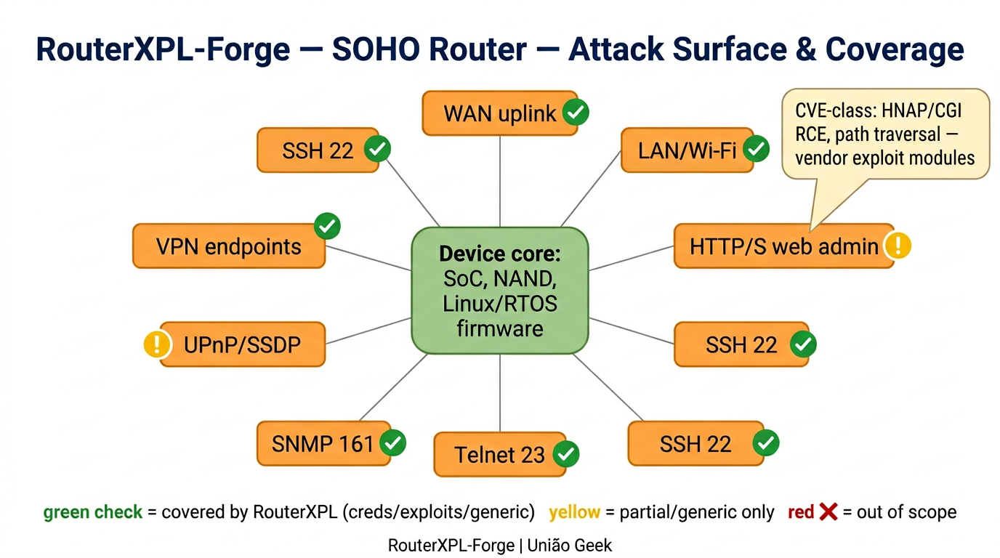
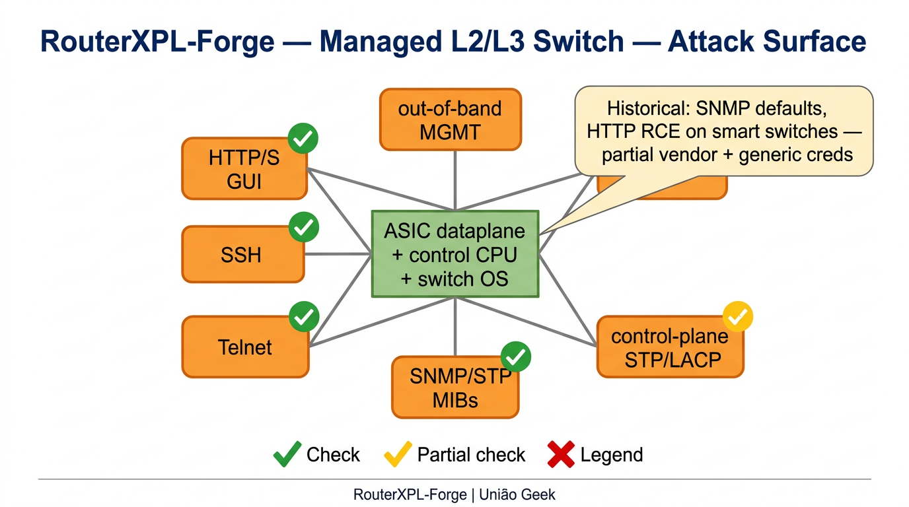
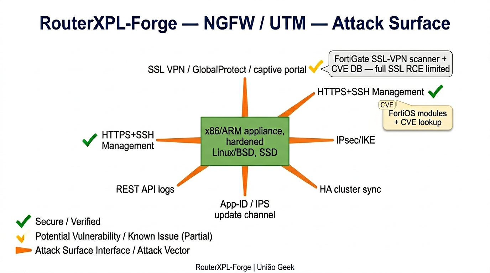
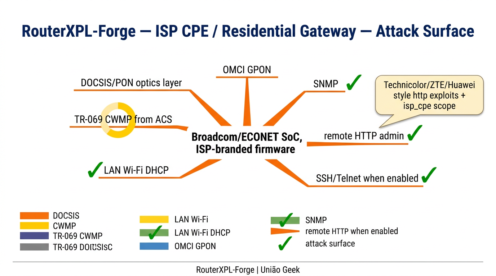
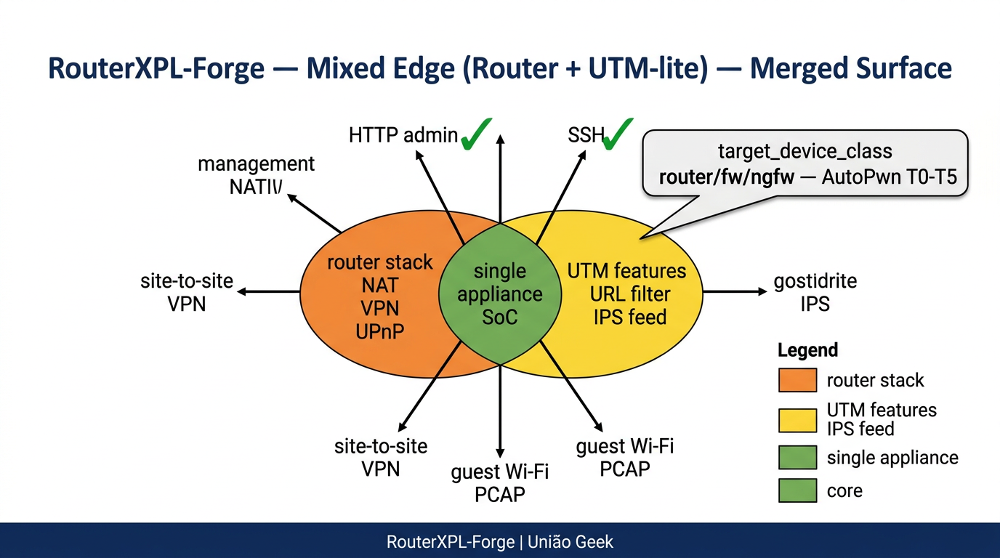

# FirewallXPL-Forge

**Perimeter security exploitation framework** — 164 modules covering **FW, NGFW, UTM, WAF, VPN, NAC, LB**, and **OT/ICS** industrial firewalls across **23 vendors** and **51+ CVEs**.

**Author:** André Henrique ([@mrhenrike](https://github.com/mrhenrike)) \| [União Geek](https://github.com/Uniao-Geek)

**Language:** **English (en-US)** — default. **Português (pt-BR):** [README.pt-BR.md](README.pt-BR.md)

[](https://www.python.org/downloads/)
[](https://github.com/mrhenrike/FirewallXPL-Forge/actions)
[](https://pypi.org/project/firewallxpl/)

## Architecture & Attack Surface Map


## Install

```bash
# From PyPI (recommended)
pip install firewallxpl

# With Rich TUI + Nmap discovery
pip install firewallxpl[tui,discovery]

# With ML engine + GPU acceleration
pip install firewallxpl[ml,gpu-nvidia]

# Everything
pip install firewallxpl[full]

# From source
git clone https://github.com/mrhenrike/FirewallXPL-Forge.git
cd FirewallXPL-Forge && pip install -e ".[tui,discovery]"
python fxf.py
```

---

## What the project does

FirewallXPL-Forge fornece **módulos** para ensaios **autorizados** contra superfície **firewall / VPN / gestão centralizada** (pentest, laboratório, red team controlado). Classes de alvo por omissão: `fw`, `ngfw`, `utm`, `waf`, `cloud_fw` (ver `module_target_scope.json`).

| Type | Role |
|------|------|
| **exploits** | Abuse known vulnerabilities (with `check()` where implemented) |
| **creds** | Default credentials and brute force against network services |
| **scanners** | Weakness identification; **autopwn** orchestrates modules with Nmap-like timing profiles |
| **generic** | Cross-cutting utilities: SNMP, SSDP, **CVE lookup**, wordlist, external bridges *(802.11 PCAP → WirelessXPL-Forge)* |
| **payloads** | Payload generation by architecture (ARM/MIPS/x86, reverse/bind shells) |
| **encoders** | Payload encoding (Python, PHP, Perl) |

**Out of scope in this repository:** modules whose primary target is IP cameras, printers, or DVRs.

### Attack-surface architecture (by device class)

Hub-and-spoke diagrams (same idea as [MikrotikAPI-BF](https://github.com/mrhenrike/MikrotikAPI-BF) `img/mikrotik_*`): device core, remote **access vectors**, and how they map to **FirewallXPL-Forge** coverage. Mermaid sources: [docs/diagrams/architecture/](docs/diagrams/architecture/).

| SOHO / home router | Managed L2–L3 switch |
|:---:|:---:|
|  |  |

| NGFW / UTM | ISP CPE / residential gateway |
|:---:|:---:|
|  |  |

| Mixed edge (router + UTM-lite) |
|:---:|
|  |

---

## Compatibility notice

> Some platforms have **not** been field-tested. If something breaks, open an issue with OS, Python version, and traceback.

| Platform | Status |
|----------|--------|
| Windows 10/11 | CI + local validation |
| WSL / Debian / Ubuntu | CI + local validation |
| Kali Linux | Validated locally |
| macOS | CI (limited field validation) |
| RHEL / Fedora / Termux | Expected compatible — not validated |

**Python:** 3.8 through 3.13. Includes a shim for removed `telnetlib` on 3.13+ (`telnetlib3`).

---

## Quick install

### Dependencies (`requirements.txt`)

- `requests`, `paramiko`, `pysnmp`, `pycryptodome`, `scapy`, `setuptools`
- `telnetlib3` on Python ≥ 3.13

### Clone and run

```bash
git clone https://github.com/mrhenrike/FirewallXPL-Forge.git
cd FirewallXPL-Forge
python3 -m venv .venv
# Linux/macOS:
source .venv/bin/activate
# Windows:
# .venv\Scripts\activate
python3 -m pip install -r requirements.txt
python3 rxf.py
```

### Environment diagnostics

```bash
python tools/env_doctor.py
```

---

## Usage overview

### Interactive shell

After `python rxf.py`:

```text
help                          # global help (+ module help if one is loaded)
use creds/generic/ssh_default # load module (slashes like paths)
set target 192.168.0.1
show options                  # editable options
show info                     # module metadata
check                         # check if target looks vulnerable (if implemented)
run                           # execute
back                          # unload module
search exit                   # modules whose path contains "exit"
search type=exploits vendor=linksys wrt
exec uname -a                 # OS shell command
exit                          # Ctrl+D also exits
```

**Search:** space-separated words are **AND**ed (all must appear in the module path). Filters: `type=`, `device=`, `language=`, `payload=`, `vendor=`.

**Global options:** `setg name value` applies across modules; `unsetg name` removes.

**Prompt:** environment variables `FXF_RAW_PROMPT` and `FXF_MODULE_PROMPT` (see `firewallxpl/interpreter.py`).

### Non-interactive mode

```bash
python rxf.py -m creds/generic/ssh_default -s "target 192.168.0.1" -s "port 22"
```

`-s` may repeat; each string is parsed like interactive `set`.

### Logs

Bootstrap logging writes to **`firewallxpl.log`** (rotating log in the current working directory).

---

## Full documentation (Wiki)

Syntax, examples by module family, troubleshooting, and the module index:

- **English (en-US, default):** [docs/wiki/en-US/README.md](docs/wiki/en-US/README.md)  
- **Português (pt-BR):** [docs/wiki/pt-BR/README.md](docs/wiki/pt-BR/README.md)  
- **Hub (both):** [docs/wiki/README.md](docs/wiki/README.md)

To publish on **GitHub Wiki**, copy the chosen locale folder (or both) into the wiki repository (separate Git clone).

---

## Other docs in the repo

| Path | Contents |
|------|----------|
| [docs/README.md](docs/README.md) · [docs/README.pt-BR.md](docs/README.pt-BR.md) | Documentation hub (en-US + pt-BR) |
| [docs/diagrams/architecture/](docs/diagrams/architecture/) | Attack-surface architecture (MikrotikAPI-BF style) + [PNGs](docs/img/architecture/) |
| [docs/COVERAGE_MATRIX.md](docs/COVERAGE_MATRIX.md) | Coverage matrix and external intel (en-US body) |
| [docs/FULL_CATALOG.md](docs/FULL_CATALOG.md) | Extended device/CVE-oriented catalog (en-US body) |
| `firewallxpl/resources/catalogs/` | JSON catalogs (market, Discord, extended CVE, etc.) |
| `tools/report_market_priority_gaps.py` | Gap report vs market-priority catalog |
| `tools/validate_market_priority_minimums.py` | Yearly minimum validation |
| `tools/generate_coverage_matrix.py` | Regenerate matrix docs |
| `tools/generate_full_catalog.py` | Regenerate `FULL_CATALOG` (footprint, sizes, module stats) |
| `tools/refresh_cve_extended_catalog.py` | Regenerate merged `cve_extended_catalog.json` |
| `# (removed tool)` | Vendor PoC snapshots into `arsenal/pocs/integrated_modules/` |

---

## Release notes — 3.4.8

- **CVE catalog:** `cve_extended_catalog.json` now merges the static matrix, `external_tool_intel_sources.json` hints, CVE strings from `firewallxpl/modules`, embedded `_EMBEDDED_CVES` scope, Discord `related_cves_hint`, and **PoC repository URLs** normalized from the vendored tg12 `cve_links.txt` (in-scope IDs only; does not load the whole global index into RAM at runtime).
- **Docs:** `FULL_CATALOG` adds **on-disk footprint**, largest paths, and first-party `.py` counts (`tools/generate_full_catalog.py`).
- **Offline Exploit-DB:** `generic/external/exploitdb_embedded_lookup` searches the bundled `files_exploits.csv` tree (no `searchsploit` CLI); legacy SearchSploit bridge modules were removed.
- **Arsenal:** Curated PoC catalog live under `firewallxpl/resources/arsenal/pocs/integrated_modules/` (GPLv2 Exploit-DB and selected repos); indexes in `firewallxpl/resources/catalogs/`. **SOHO exploit catalog** bundle + `scanners/misc/soho_exploit_catalog_server` for local HTTP viewing in lab.

---

## Tests and quality (contributors)

```bash
python tools/compat_smoke.py
python tools/validate_market_priority_minimums.py
python tools/generate_coverage_matrix.py
```

---

## Governance (bilingual files)

| English (default) | Português (pt-BR) |
|-------------------|---------------------|
| [CONTRIBUTING.md](CONTRIBUTING.md) | [CONTRIBUTING.pt-BR.md](CONTRIBUTING.pt-BR.md) |
| [CODE_OF_CONDUCT.md](CODE_OF_CONDUCT.md) | [CODE_OF_CONDUCT.pt-BR.md](CODE_OF_CONDUCT.pt-BR.md) |
| [SECURITY.md](SECURITY.md) | [SECURITY.pt-BR.md](SECURITY.pt-BR.md) |
| [CONTRIBUTORS.md](CONTRIBUTORS.md) | [CONTRIBUTORS.pt-BR.md](CONTRIBUTORS.pt-BR.md) |

---

## License

BSD — see [LICENSE](LICENSE). Current maintenance is described in this file and in project metadata.

---

## Acknowledgments

- [Riposte](https://github.com/fwkz/riposte) — interactive shell pattern
- Community contributions to the original [mrhenrike/FirewallXPL-Forge](https://github.com/mrhenrike/FirewallXPL-Forge)
- Contributors listed in [CONTRIBUTORS.md](CONTRIBUTORS.md)

---

> **Author:** André Henrique ([@mrhenrike](https://github.com/mrhenrike)) \| **União Geek** — [https://github.com/Uniao-Geek](https://github.com/Uniao-Geek)
